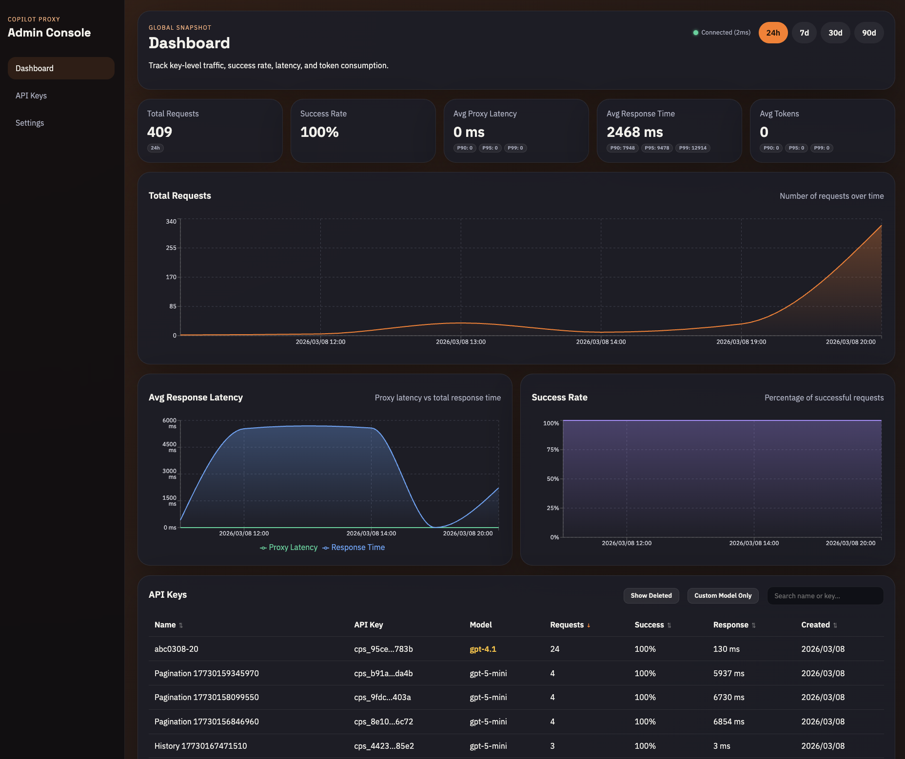
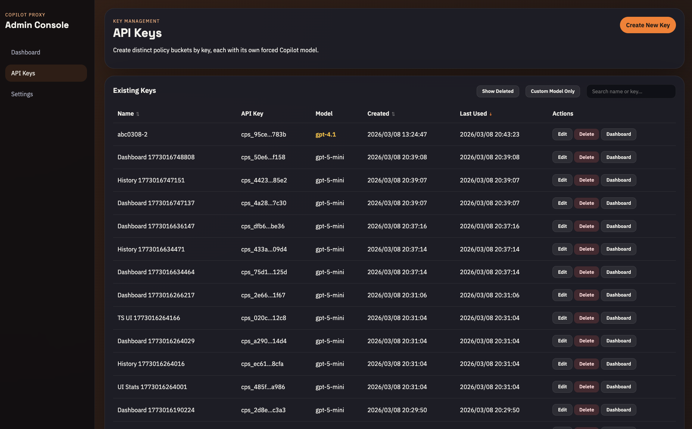
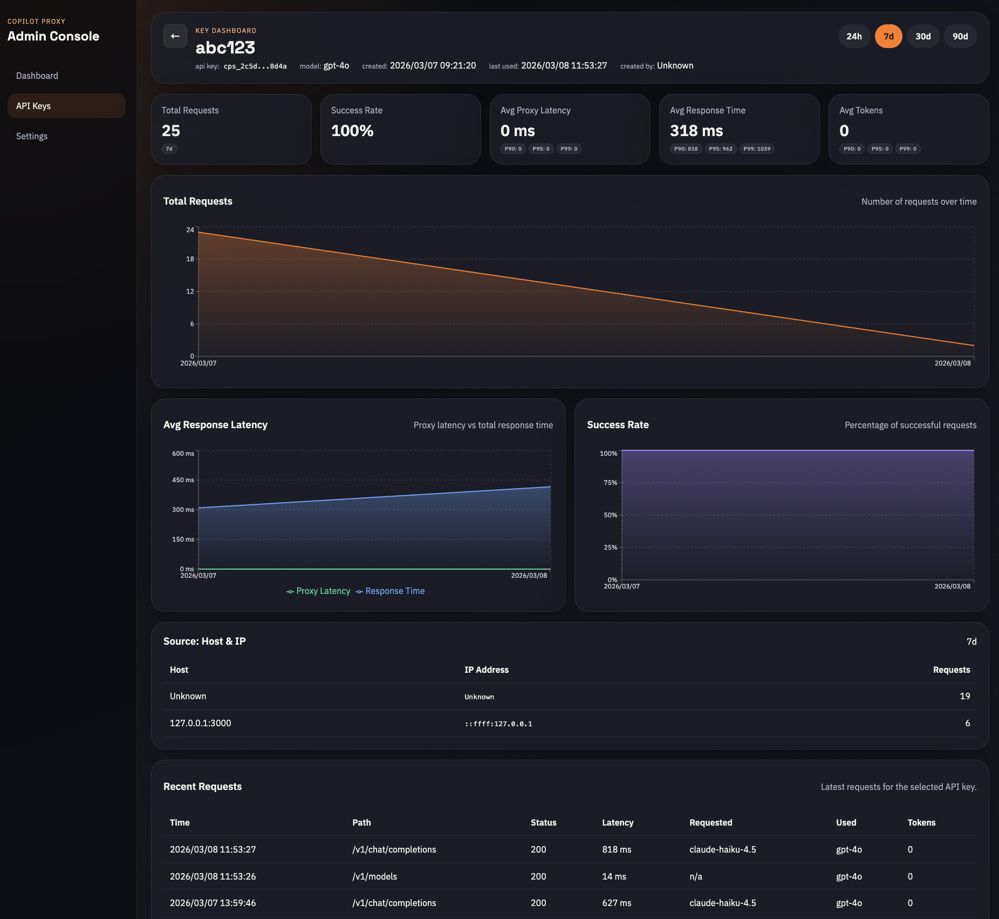
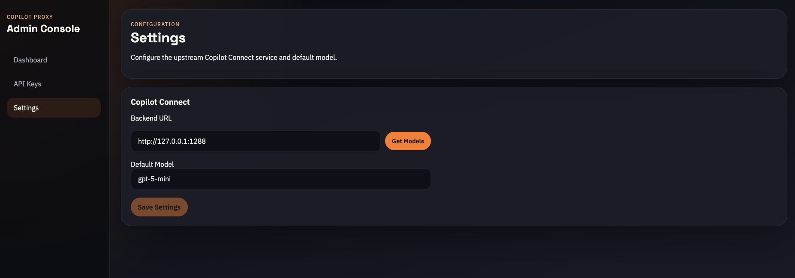

# Copilot Proxy

An OpenAI-compatible API gateway that validates API keys, enforces per-key model binding, and forwards requests to Copilot Connect.

## Features

- **Per-key model binding** — each API key is locked to a specific model; the `model` field in incoming requests is always ignored
- **Dashboard** — real-time metrics with 5 cards (total requests, success rate, proxy latency, response time, avg tokens), P90/P95/P99 percentiles, and interactive timecharts
- **Health indicator** — polls upstream Copilot Connect every 30 seconds
- **API key management** — create, edit, and soft-delete keys via modal-based UI; search, sort, and filter; see `last_used_at` timestamp for each key
- **Key-level dashboard** — per-key statistics, timeline charts, recent error logs, and **calls breakdown by client IP address and Host header**
- **Settings** — configure upstream Copilot URL and default model; test connection to discover available models
- **Soft delete** — deleted keys retain historical data and statistics; proxy rejects them with 401
- **Request tracking** — each API request logs the client IP address and Host header for analysis and debugging

## Screenshots

<table>
<tr>
  <td><strong>Dashboard</strong> — Overview of real-time metrics, request volume, success rates, and performance percentiles</td>
</tr>
<tr>
  <td></td>
</tr>
<tr>
  <td><strong>API Key List</strong> — Create, manage, and search API keys; view per-key statistics at a glance</td>
</tr>
<tr>
  <td></td>
</tr>
<tr>
  <td><strong>API Key Details</strong> — Drill into per-key metrics, timeline charts, error logs, and client breakdown</td>
</tr>
<tr>
  <td></td>
</tr>
<tr>
  <td><strong>Settings</strong> — Configure upstream Copilot URL and default model; test connection and discover available models</td>
</tr>
<tr>
  <td></td>
</tr>
</table>

## Requirements

- Node.js 18+
- npm 9+

## Quick Start

```bash
# Start all services (installs deps on first run)
./start.sh

# Stop all services
./stop.sh
```

This starts three processes:

| Service            | URL                   | Notes                               |
| ------------------ | --------------------- | ----------------------------------- |
| Admin UI           | http://localhost:3020 | Dashboard and key management        |
| Admin API          | http://localhost:8020 | Internal used by UI                 |
| Client API (proxy) | http://localhost:8022 | OpenAI-compatible; requires API key |

**Important Notice:** Production mode requires a Cloudflared Access JWT token. Cloudflare Access enforces authentication for the Admin API — requests must present a valid `CF-Access-JWT-Assertion` token (or run the UI/API behind a properly configured cloudflared tunnel with Access enabled).

## Manual Setup

### 1. Install dependencies

```bash
npm install
```

### 2. Start the proxy server

```bash
cd server && npx tsx src/index.ts
```

### 3. Start the admin UI

```bash
cd ui && npx vite
```

## Creating an API Key

Use the Admin UI at http://localhost:3020, or call the admin API directly:

```bash
curl -s -X POST http://localhost:8020/api/keys \
  -H "Content-Type: application/json" \
  -d '{"name": "my-app", "model": "gpt-4o"}' | jq .
```

The response contains the raw key (shown only once) and the key record. Use the raw key as a Bearer token:

```bash
curl -s http://localhost:8022/v1/models \
  -H "Authorization: Bearer cps_<your-key>"
```

```bash
curl -s -X POST http://localhost:8022/v1/chat/completions \
  -H "Authorization: Bearer cps_<your-key>" \
  -H "Content-Type: application/json" \
  -d '{"model": "gpt-4o", "messages": [{"role": "user", "content": "Hello"}]}' | jq .
```

> **Model override** — The `model` field in the request body is ignored. The proxy always forwards using the model bound to the API key.

## Configuration

Copy and edit the environment file:

```bash
cp .env.example .env   # Optional; defaults are applied if missing
```

## Project Structure

```
CopilotProxy/
├── server/          # Proxy server (Express + SQLite)
│   └── src/
│       ├── routes/  # /v1/* proxy, /api/* admin
│       ├── services/   # proxyService, statsService, settingsService
│       ├── middleware/
│       └── db/
├── ui/              # Admin dashboard (React + Vite)
│   └── src/
│       ├── pages/   # Dashboard, KeysManage, KeyDetail, Settings
│       └── components/  # MetricCard, TimelineChart, HealthIndicator, Modal
├── tests/
│   ├── api/         # Jest + supertest integration tests
│   └── e2e/         # Playwright end-to-end tests
├── docs/            # Documentation and screenshots
├── start.sh
└── stop.sh
```

## Admin API

| Method   | Endpoint                             | Description                                            |
| -------- | ------------------------------------ | ------------------------------------------------------ |
| `GET`    | `/api/keys?search=&sortBy=&sortDir=` | List keys with stats                                   |
| `POST`   | `/api/keys`                          | Create key (model optional; defaults from settings)    |
| `PATCH`  | `/api/keys/:id`                      | Update key name/model/is_active                        |
| `DELETE` | `/api/keys/:id`                      | Soft-delete key (returns `200 { ok: true }`)           |
| `GET`    | `/api/keys/:id/stats?window=`        | Key statistics, P-values, timeline, errors             |
| `GET`    | `/api/keys/:id/history?page=&limit=` | Paginated request history                              |
| `GET`    | `/api/overview?window=`              | Global metrics, P-values, timeline, key summaries      |
| `GET`    | `/api/settings`                      | Read settings (copilot_url, default_model)             |
| `PUT`    | `/api/settings`                      | Update settings                                        |
| `GET`    | `/api/health/copilot`                | Test upstream connection (returns ok, latency, models) |

Time windows: `24h`, `7d`, `30d`, `90d`

## Development

Requires CopilotConnect running upstream. Run server and UI in watch mode:

```bash
npm run dev
```

Alternatively, with more control:

```bash
npm run dev:server  # Server with hot reload
npm run dev:ui     # UI with hot reload
```

Run tests:

```bash
# API integration tests (Jest + supertest)
npm run test:api

# E2E tests (Playwright — auto-starts dev server)
npm run test:e2e
```
